# 🔄 Diagramas de Máquina de Estados dos Componentes

Este documento contém os diagramas de máquina de estados dos principais componentes do projeto cosmic-space.

---

## 1. AuthChatFlow - Fluxo de Autenticação

O componente `AuthChatFlow` implementa um fluxo conversacional para login e cadastro.

### 1.1 Máquina de Estados Principal

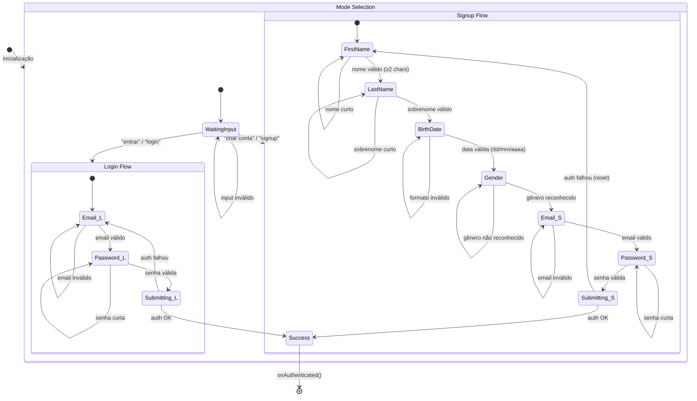

### 1.2 Estados do Step (AuthStep)

```mermaid
stateDiagram-v2
    [*] --> mode
    
    mode --> email: Login selecionado
    mode --> firstName: Signup selecionado
    
    firstName --> lastName
    lastName --> birthDate
    birthDate --> gender
    gender --> email
    
    email --> password
    password --> [*]: Autenticação bem-sucedida
    
    note right of mode: Escolha inicial do usuário
    note right of gender: Sugestões disponíveis:\n- feminino\n- masculino\n- outro\n- prefiro não informar
```

### 1.3 Estados de Submissão

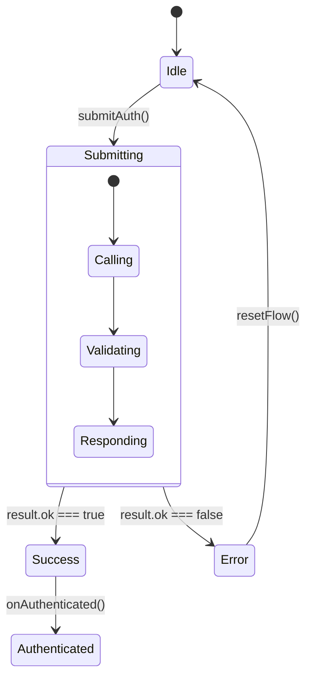

---

## 2. EmotionalInput - Seletor de Emoções

O componente `EmotionalInput` permite ao usuário selecionar e registrar emoções.

### 2.1 Máquina de Estados Principal

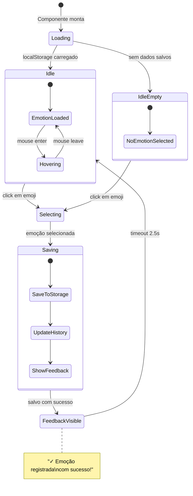

### 2.2 Estados de Interação

```mermaid
stateDiagram-v2
    [*] --> Default
    
    Default --> Hovered: onMouseEnter
    Hovered --> Default: onMouseLeave
    
    Default --> Selected: onClick
    Hovered --> Selected: onClick
    
    Selected --> JustSaved: localStorage.setItem()
    JustSaved --> Selected: timeout 2.5s
    
    state Hovered {
        [*] --> ShowTooltip
    }
    
    state JustSaved {
        [*] --> ShowCheckmark
        ShowCheckmark --> ShowSuccessBanner
    }
```

---

## 3. MenstrualTracker - Rastreador Menstrual

O componente `MenstrualTracker` permite registrar e visualizar dados menstruais.

### 3.1 Máquina de Estados Principal

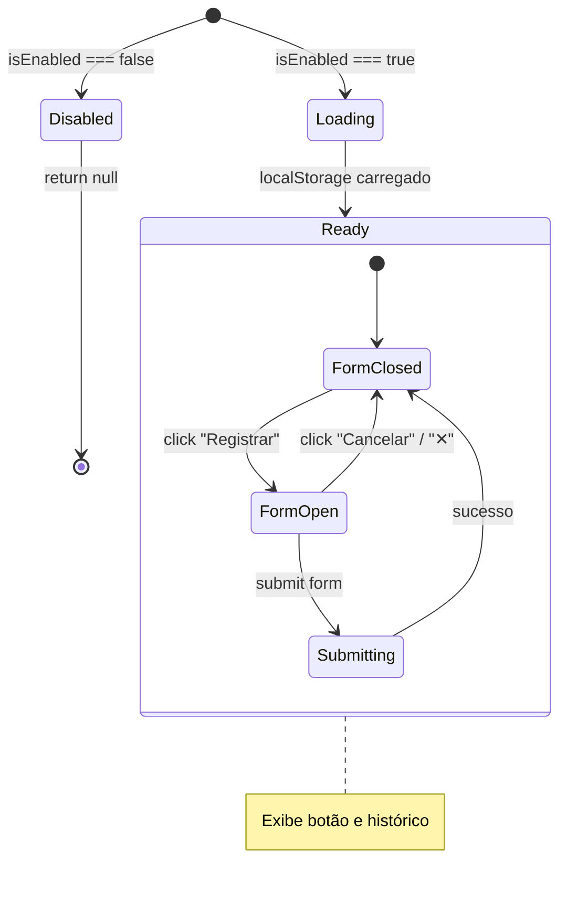

### 3.2 Estados do Formulário

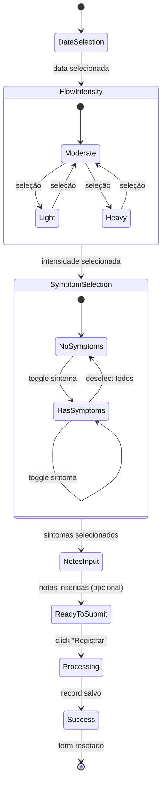

### 3.3 Dados Lunares (side effect)

```mermaid
stateDiagram-v2
    [*] --> NoMoonData
    
    NoMoonData --> FetchingMoonData: selectedDate muda
    FetchingMoonData --> MoonDataLoaded: getLunarPhaseAndSign()
    MoonDataLoaded --> FetchingMoonData: selectedDate muda
    
    note right of MoonDataLoaded: Exibe:\n- Fase Lunar\n- Signo Zodiacal
```

---

## 4. LunarCalendarWidget - Calendário Lunar

O componente `LunarCalendarWidget` exibe um calendário com informações lunares.

### 4.1 Máquina de Estados de Navegação

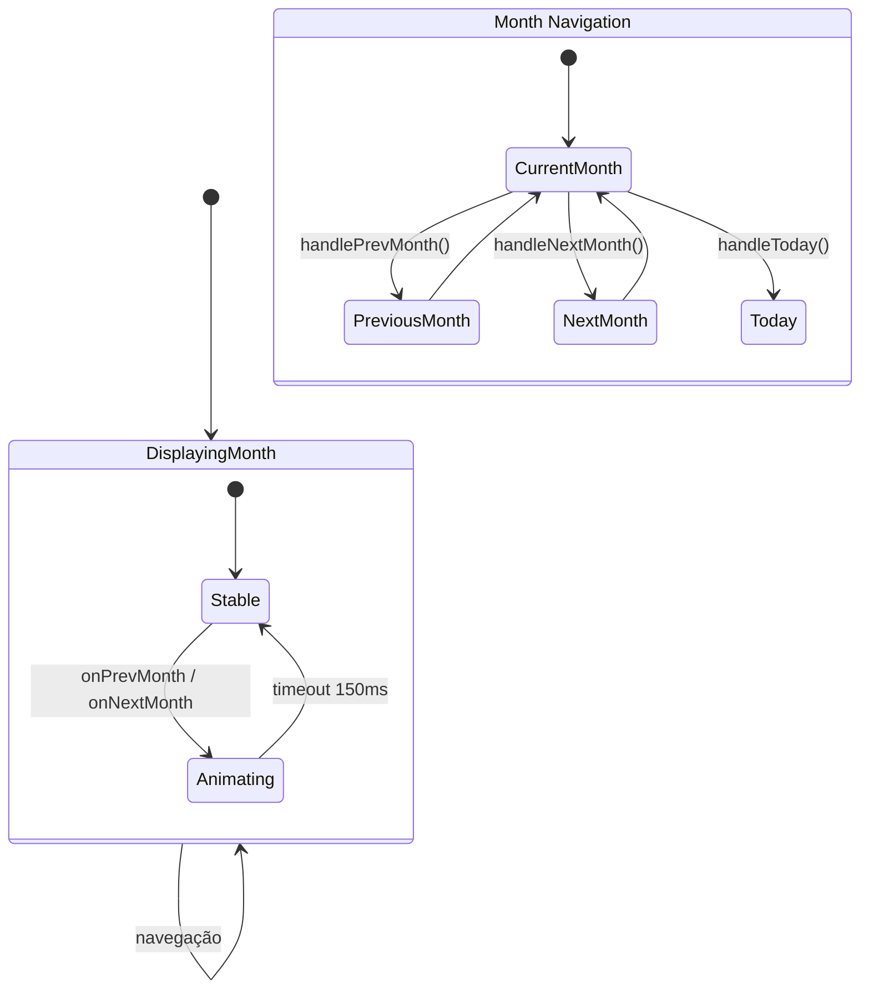

### 4.2 Estados de Seleção de Data

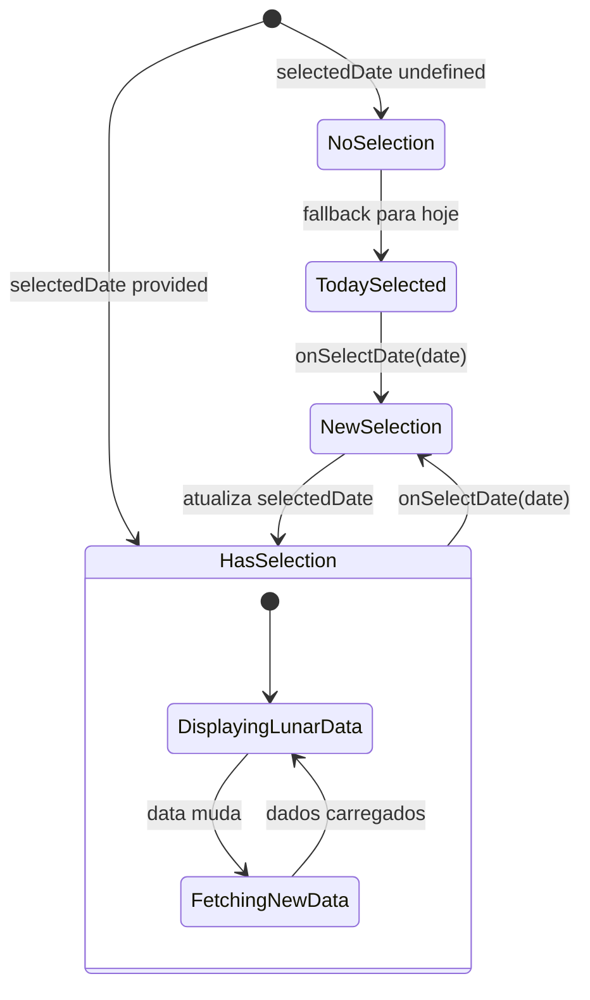

### 4.3 Estados de Animação

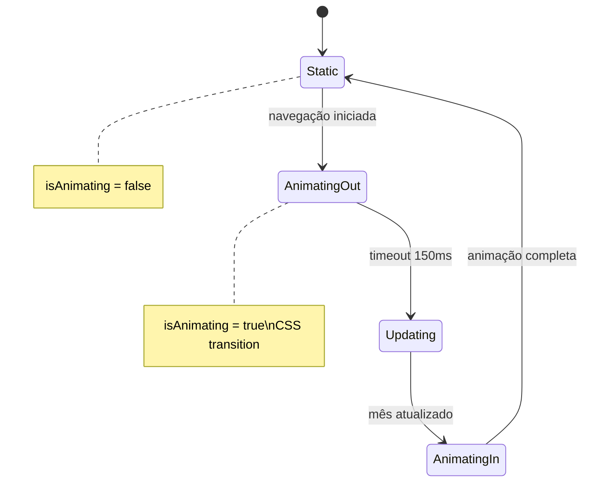

---

## 5. TodoPanel - Painel de Tarefas

O componente de tarefas usa um reducer para gerenciar estado complexo.

### 5.1 Máquina de Estados Principal (Reducer)

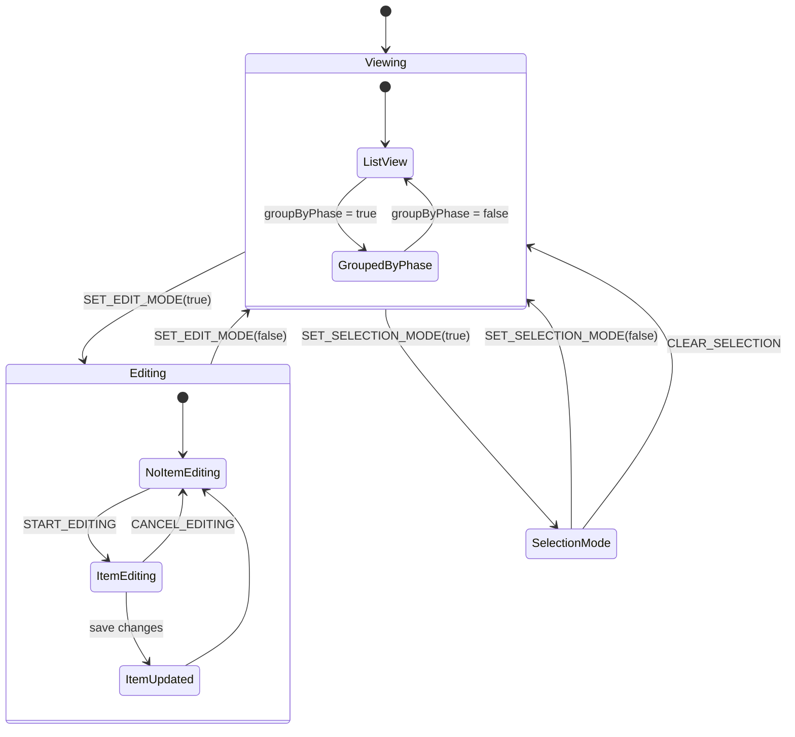

### 5.2 Estados de Seleção em Lote

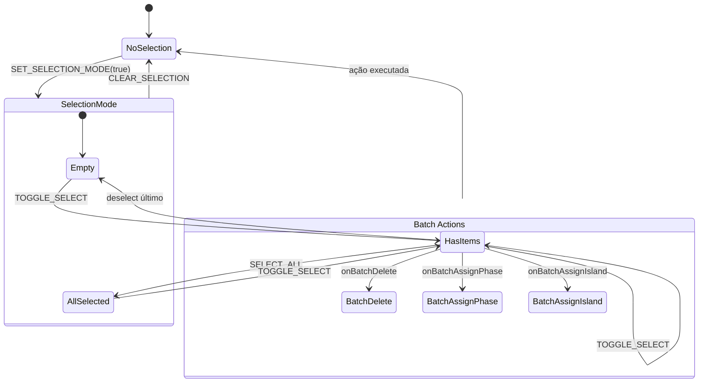

### 5.3 Estados de Edição de Item

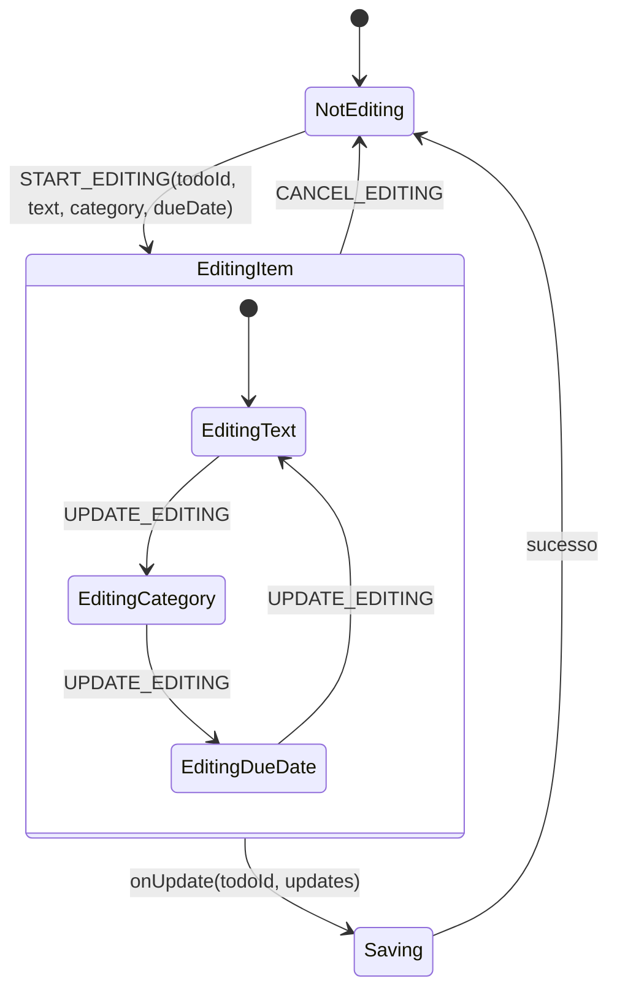

### 5.4 Estados de Paginação

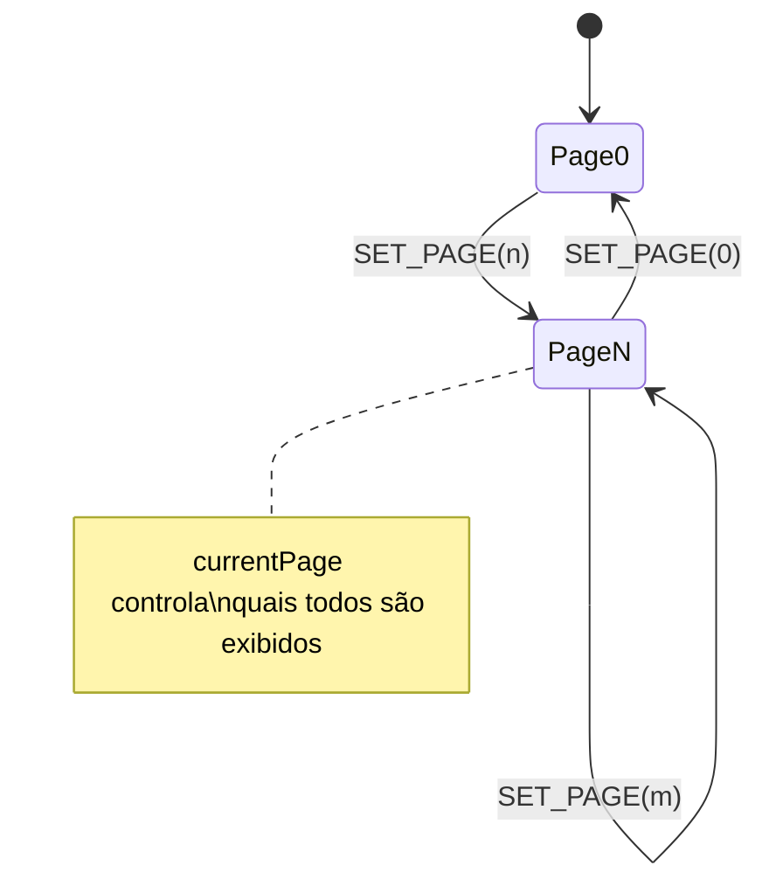

### 5.5 Estados das Fases Expandidas

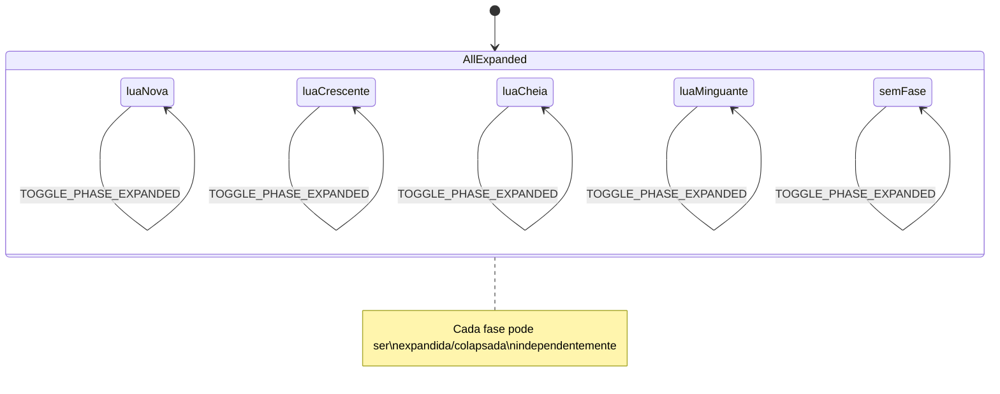

---

## 6. AuthGate - Portão de Autenticação

O componente `AuthGate` controla acesso a conteúdo protegido.

### 6.1 Máquina de Estados

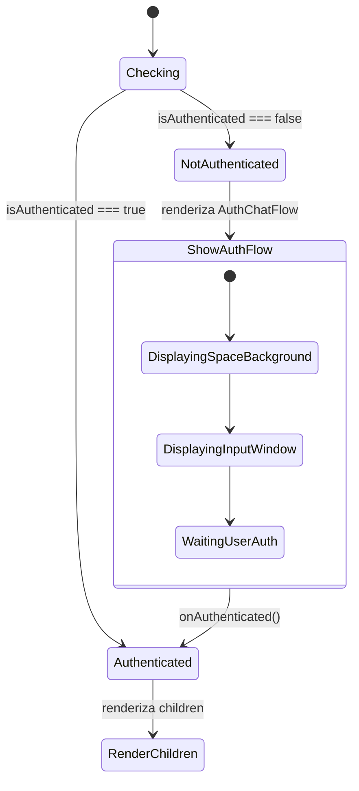

---

## 7. Sync Components - Componentes de Sincronização

### 7.1 AutoSyncLunar (padrão genérico)

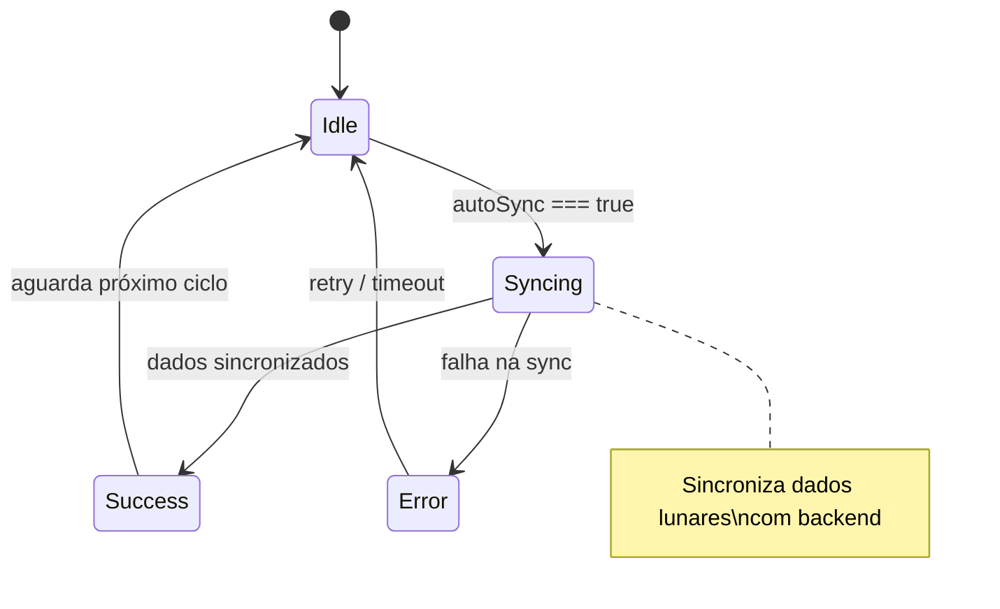

---

## Legenda

| Símbolo | Significado |
|---------|-------------|
| `[*]` | Estado inicial ou final |
| `-->` | Transição de estado |
| `state X { }` | Estado composto (nested) |
| `: evento / ação` | Gatilho da transição |
| `note` | Comentário/documentação |

---

## Resumo dos Componentes

| Componente | Estados Principais | Complexidade |
|------------|-------------------|--------------|
| AuthChatFlow | 7 steps + 2 modos | Alta |
| EmotionalInput | 4 estados + feedback | Média |
| MenstrualTracker | 3 estados + form | Média |
| LunarCalendarWidget | Navegação + seleção | Média |
| TodoPanel (Reducer) | 6 actions principais | Alta |
| AuthGate | 2 estados binários | Baixa |

---

*Documento gerado automaticamente para documentação do projeto cosmic-space.*
